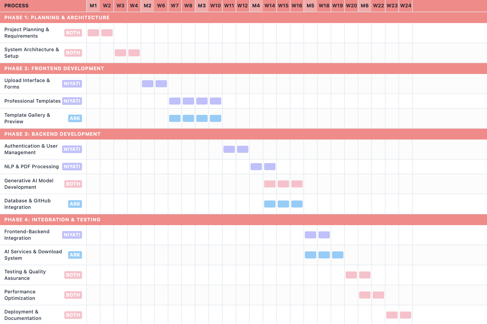

# PortfolioGen: AI-Powered Portfolio & Resume Generator

## 🚀 Project Description

AutoResume is a full-stack web application designed to revolutionize how professionals create their portfolios and resumes. By intelligently leveraging existing professional data from a user's LinkedIn profile and GitHub, the application automates content creation and allows users to generate a personalized, professional portfolio in minutes.

The system uses Natural Language Processing (NLP) to extract key information and Generative AI to craft compelling content. Users can select from a gallery of professionally-designed templates, preview their unique portfolio in real-time, and download a complete, customizable HTML, CSS, and JavaScript package.

## ✨ Features

* **Intelligent Data Extraction:** Upload a LinkedIn profile PDF and provide a GitHub link to automatically extract personal, professional, and project data.
* **AI-Generated Content:** Generative AI crafts unique and descriptive content, such as project summaries and professional bios, to create a compelling narrative.
* **Live Preview:** Instantly see a live, dynamic preview of your personalized portfolio as it's populated with your extracted and AI-generated information.
* **Professional Templates:** Choose from a gallery of four pre-designed, responsive, and professional templates.
* **Full Ownership:** Download a complete, self-contained package of HTML, CSS, and JavaScript files, giving you full control to host and customize your portfolio.

## 🛠️ Technology Stack

* **Frontend:** React.js, Taileind CSS
* **Backend:** Python, FastAPI
* **AI/ML:** BERT Transformers (for NLP and Generative AI)
* **Database:** PostgreSQL (via Amazon RDS)
* **Deployment:** AWS (EC2, S3, RDS)

## 💡 How It Works

1. **Upload & Link:** Users upload their LinkedIn PDF and provide a GitHub URL.
2. **Extract & Generate:** The back end uses NLP to extract data and Generative AI to write content.
3. **Preview:** The front end displays a dynamic preview of the chosen template with the new content.
4. **Download:** Users download a `.zip` file containing all the necessary code.

## ⏰ Project Timeline (Gantt Chart)

This project is developed by:

* **Niyati Patel**
* **Ark Patel**

## 📄 License

This project is licensed under the MIT License - see the [LICENSE](LICENSE) file for details.
